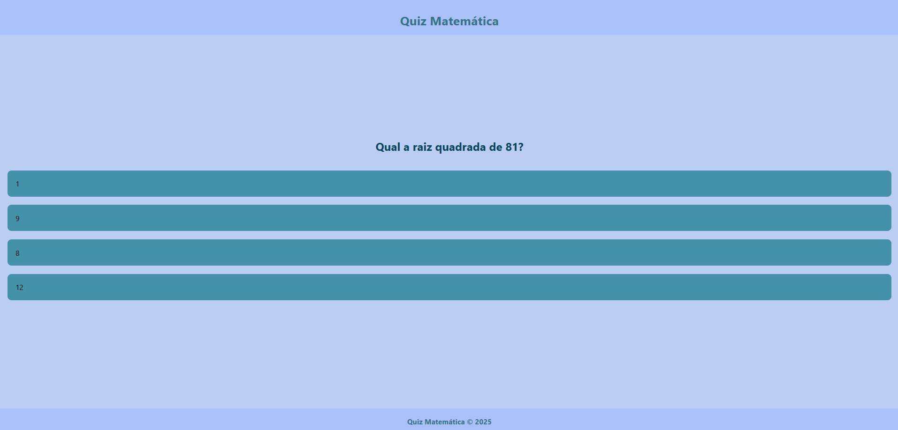

# App desenvolvido de Quiz Matematico em React Native (Expo Router)

Site e app desenvolvido em react native de quiz matematico (expo router)

## Tecnologias Utilizadas para o Desenvolvimento
| Linguagens e Ferramentas  | Funcionalidade |
| ------------- |:-------------:|
| [Vscode](https://code.visualstudio.com/)    | IDE (Ambiente integrado de desenvolvimento) |
| [NodeJS](https://nodejs.org/pt)    | Interpretar codigos em JavaScript (Vanilla) |
| [Git](https://git-scm.com/downloads)    | Ferramenta colaborativa de versionamento |

## Como testar 

Para começar, certifique-se de ter o Expo CLI instalado. Se ainda não o fez, você pode instalá-lo com o seguinte comando:
```bash
npm install -g expo-cli
```
Em seguida, crie um novo projeto React Native com o Expo, já na versão mais recente do Expo que possui o Expo-router integrado:
```bash
npx create-expo-app@latest posts
cd posts
npm run reset-project
```

## Foto do Quiz



